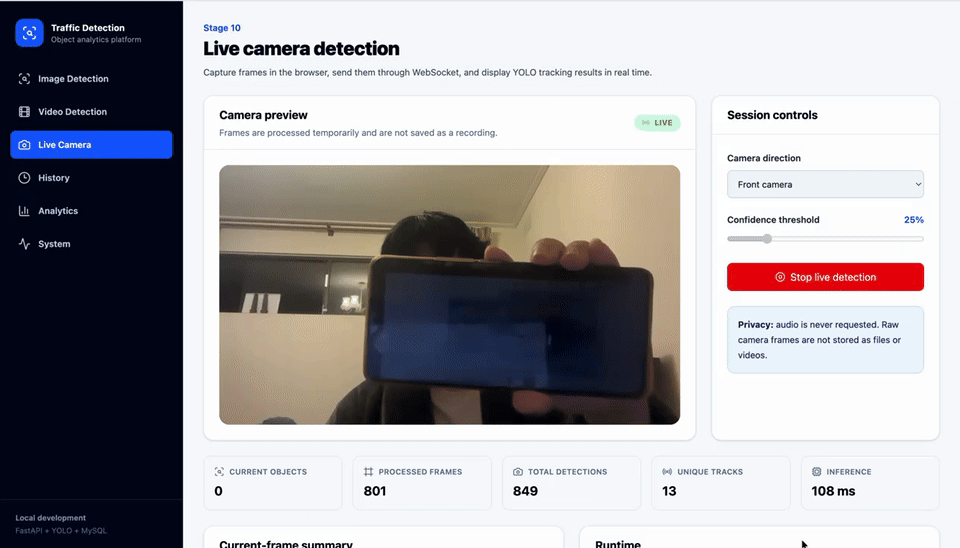
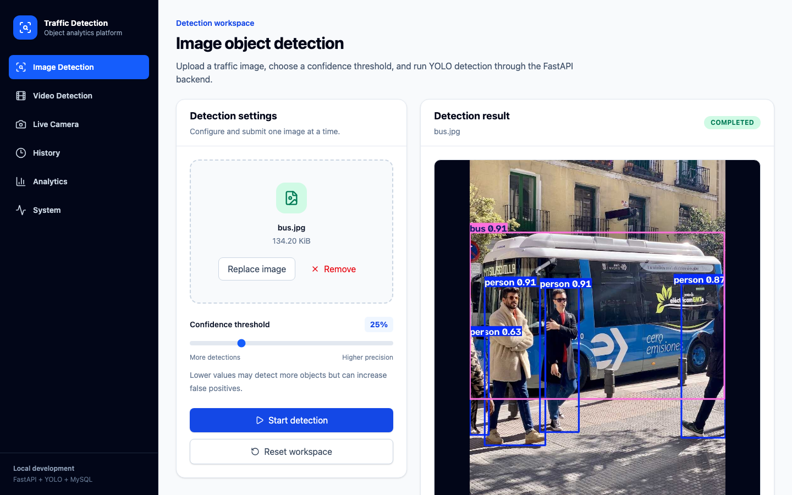
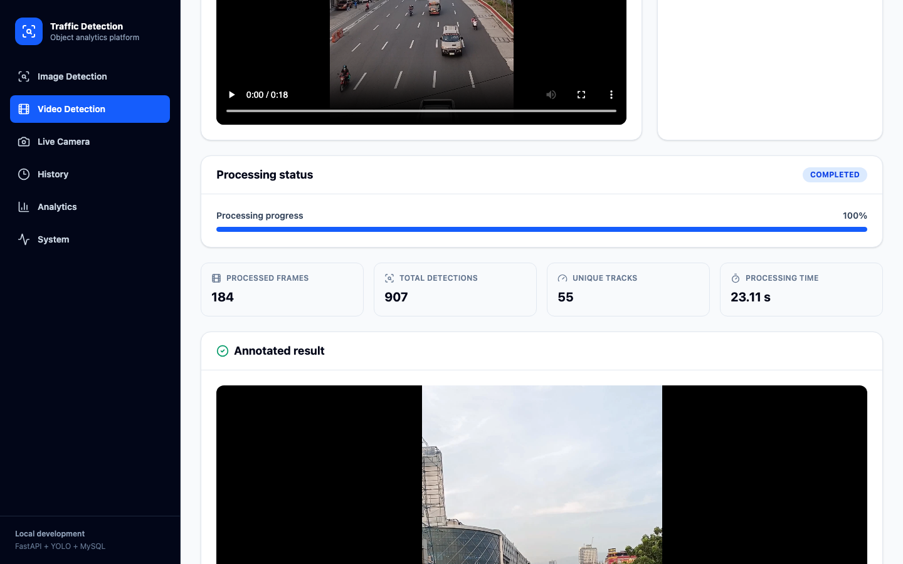
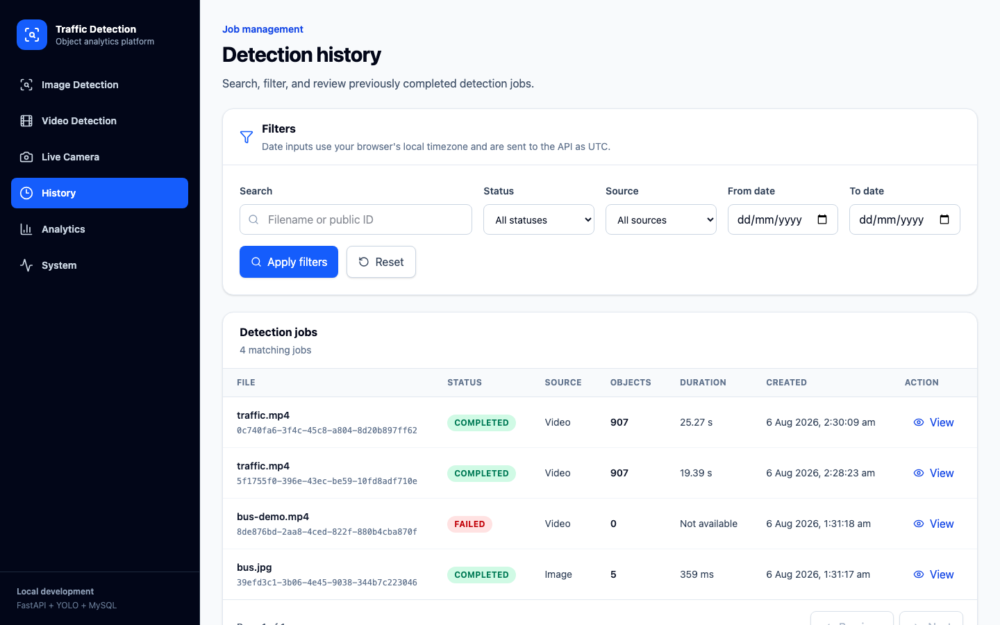
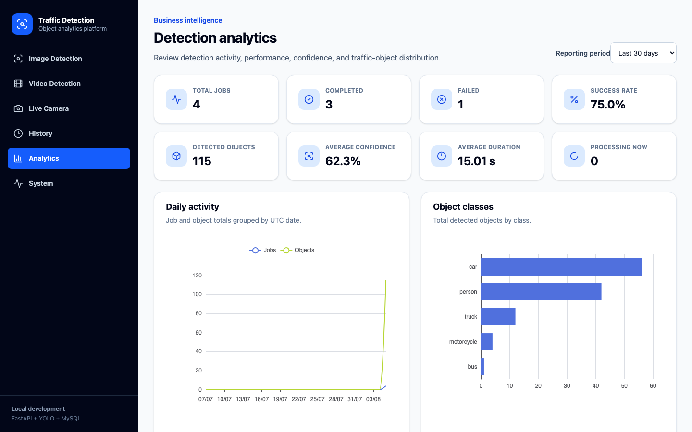
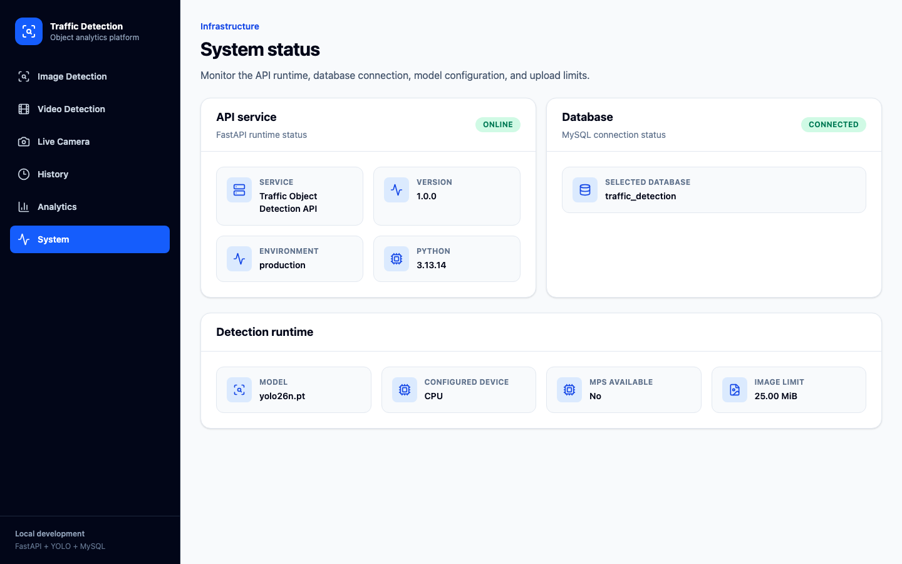
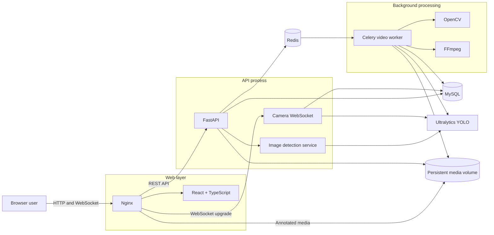
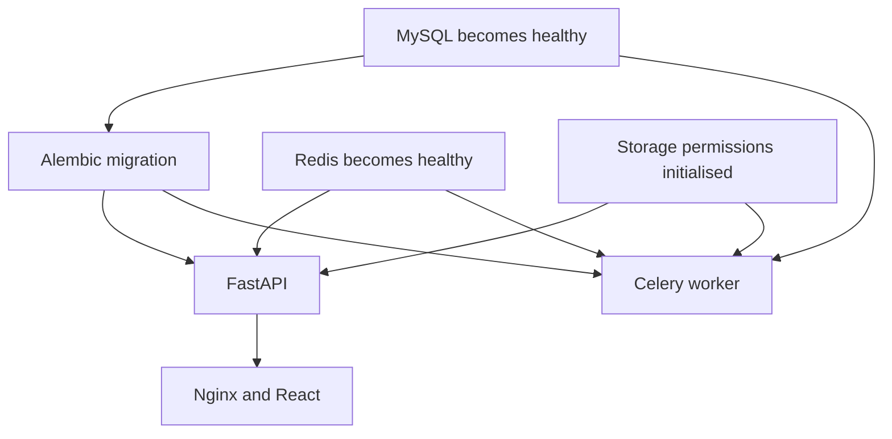

# Real-Time Traffic Object Detection Platform

**Image Detection, Video Tracking, Live Camera Inference, and Traffic Analytics**

[](https://github.com/Lance-Gan/traffic-object-detection-platform/actions/workflows/ci.yml)


The Real-Time Traffic Object Detection Platform is a full-stack computer-vision application built with FastAPI, React, MySQL, Redis, Celery, OpenCV, FFmpeg, WebSocket, and Ultralytics YOLO.

It supports three traffic-analysis workflows:

- detecting supported objects in uploaded images;
- processing uploaded videos asynchronously with persistent tracking IDs;
- performing browser-camera detection through a WebSocket connection.

The platform stores detection jobs and representative object records in MySQL, exposes searchable history and analytics dashboards, generates annotated media, and includes automated tests, structured logging, security controls, Docker deployment, and GitHub Actions continuous integration.

The default supported traffic classes are:

```text
person
bicycle
car
motorcycle
bus
truck
traffic light
stop sign
```

> **Project scope:** This repository is a portfolio and learning project demonstrating full-stack engineering, computer vision, asynchronous processing, WebSocket communication, relational data modelling, testing, observability, security controls, and containerised deployment. It is not a certified traffic-safety, surveillance, law-enforcement, or autonomous-driving system.

---

## Table of contents

- [Demo](#demo)
- [Screenshots](#screenshots)
- [Key features](#key-features)
- [How the system works](#how-the-system-works)
- [Architecture](#architecture)
- [Detection and tracking pipelines](#detection-and-tracking-pipelines)
- [Data model and counting semantics](#data-model-and-counting-semantics)
- [Technology stack](#technology-stack)
- [Quick start with Docker](#quick-start-with-docker)
- [Model setup](#model-setup)
- [Native macOS development](#native-macos-development)
- [API overview](#api-overview)
- [Configuration](#configuration)
- [Testing and code quality](#testing-and-code-quality)
- [Observability and error handling](#observability-and-error-handling)
- [Security notes](#security-notes)
- [Privacy and data retention](#privacy-and-data-retention)
- [Project structure](#project-structure)
- [Operational commands](#operational-commands)
- [Known limitations](#known-limitations)
- [Roadmap](#roadmap)
- [Portfolio talking points](#portfolio-talking-points)
- [Acknowledgements](#acknowledgements)
- [Licensing](#licensing)
- [Author](#author)

---

## Demo

### Video detection and tracking


The video demonstration shows the asynchronous tracking workflow:

```text
Upload a video
        ↓
Create a pending detection job
        ↓
Process frames with Celery and YOLO
        ↓
Track objects with persistent track IDs
        ↓
Generate the annotated H.264 result
        ↓
Review progress, counts, and the completed video
```

### Live camera detection



The live-camera demonstration shows the browser WebSocket workflow:

```text
Request browser camera permission
        ↓
Capture and compress one frame
        ↓
Send the JPEG frame through WebSocket
        ↓
Run persistent YOLO tracking
        ↓
Return JSON detections
        ↓
Draw bounding boxes in the browser
        ↓
Update session metrics and unique-track counts
```

The camera demonstration must not imply that microphone permission is
requested or that a camera recording is stored.

The repository does not include private source media, generated videos, database backups, or model weights.

---

## Screenshots

### Image detection



The image workspace validates JPEG, PNG, and WebP uploads, lets the user select a confidence threshold, and displays the annotated result with class counts and detection details.

### Video tracking



The video workspace uploads MP4, MOV, or WebM files, displays upload and processing progress, polls the asynchronous job, and plays the final H.264 result.

### Live camera detection


The live camera page requests browser video permission, sends compressed JPEG frames through WebSocket, and draws returned tracking boxes on a canvas overlay.

### Detection history



The history page supports pagination, filename or UUID search, status filtering, source filtering, date filtering, and detailed result review.

### Analytics



The analytics page displays job metrics, object-class distribution, source distribution, daily activity, average confidence, average duration, and success rate.

### System status



The system page displays FastAPI, MySQL, Python, model, device, MPS, and upload-limit information.

---

## Key features

### Image object detection

- Accepts JPEG, PNG, and WebP images.
- Validates declared media type and decoded image content.
- Limits image upload size through backend configuration.
- Uses a UUID-based stored filename rather than trusting the client filename.
- Runs YOLO inference on supported traffic classes.
- Generates an annotated result image.
- Stores job metadata and detected bounding boxes in MySQL.
- Returns class counts, confidence values, and coordinates.
- Supports Apple MPS in native macOS mode when available.

### Asynchronous video tracking

- Accepts MP4, MOV, and WebM uploads.
- Validates file size, decodability, metadata, dimensions, and duration.
- Creates a pending database job and immediately returns HTTP `202 Accepted`.
- Sends long-running work to Redis and Celery.
- Samples source frames toward a configurable target FPS.
- Uses persistent YOLO tracking with ByteTrack.
- Reads `track_id` values from tracking results.
- Updates database progress during processing.
- Separates total detection occurrences from unique tracked objects.
- Stores one representative record for each unique track.
- Draws class names, confidence scores, and track IDs.
- Uses FFmpeg to create browser-compatible H.264 MP4 output.
- Preserves source audio when an audio stream is available.
- Uses MP4 fast-start metadata placement for improved browser playback.

### Browser-camera detection

- Requests camera access from the browser, not from the API server.
- Never requests microphone permission.
- Creates a database-backed camera session.
- Sends compressed JPEG frames through WebSocket.
- Waits for each server result before sending another frame.
- Avoids an uncontrolled frame queue and excessive latency.
- Uses persistent tracking across consecutive camera frames.
- Returns JSON detections rather than encoded result images.
- Draws overlays in the browser with HTML canvas.
- Displays current objects, processed frames, inference time, server FPS, total detections, and unique tracks.
- Stops browser media tracks when the session ends or the page unmounts.
- Stores session metrics and representative tracks without storing a camera recording.

### Detection history

- Lists image, video, and camera jobs.
- Uses server-side pagination.
- Supports status and source-type filters.
- Supports filename and public UUID search.
- Supports creation-date range filtering.
- Displays result images and result videos.
- Displays object frame index and tracking ID when applicable.
- Uses accessible dialogs and keyboard interaction.
- Formats timestamps for the configured frontend locale.

### Analytics

- Displays total, completed, failed, processing, and pending jobs.
- Calculates success rate.
- Displays total detected objects.
- Calculates average confidence and processing duration.
- Groups representative objects by class.
- Groups jobs by source type.
- Displays daily job and object activity.
- Provides 7-day, 30-day, 90-day, and 365-day ranges.
- Uses label sampling and ECharts data zoom for long time ranges.
- Supports responsive chart resizing.
- Enables chart accessibility descriptions.

### System and health information

- Exposes API runtime health.
- Verifies MySQL connectivity.
- Reports application version and environment.
- Reports Python version.
- Reports configured model and inference device.
- Reports Apple MPS availability.
- Reports image upload limits.
- Allows Docker and reverse-proxy health checks.

### Engineering quality

- Uses SQLAlchemy 2 models and repositories.
- Uses Alembic migrations.
- Uses separate development and test databases.
- Includes backend unit and API integration tests.
- Includes WebSocket protocol tests.
- Uses fake inference services during routine tests.
- Includes frontend component and utility tests.
- Includes Playwright browser smoke tests.
- Uses Ruff, Mypy, ESLint, TypeScript, and Prettier.
- Uses structured JSON logs and request IDs.
- Adds trusted-host, security-header, and request-size middleware.
- Runs application containers as non-root users.
- Uses isolated Docker networks.
- Uses GitHub Actions CI and Dependabot.

---

## How the system works

### Image request

```text
Browser selects an image
        ↓
React validates size and type
        ↓
FastAPI receives multipart upload
        ↓
Backend validates decoded image content
        ↓
YOLO performs object detection
        ↓
Annotated image is written
        ↓
Job and objects are committed to MySQL
        ↓
React displays result and statistics
```

### Video request

```text
Browser selects a video
        ↓
React validates type, size, and visible metadata
        ↓
FastAPI validates and stores the source video
        ↓
MySQL job is created with status=pending
        ↓
FastAPI sends a Celery task to Redis
        ↓
HTTP 202 is returned to the browser
        ↓
Celery loads the video and YOLO model
        ↓
OpenCV reads and samples frames
        ↓
YOLO + ByteTrack produces detections and track IDs
        ↓
Progress is periodically written to MySQL
        ↓
OpenCV writes an annotated temporary video
        ↓
FFmpeg creates H.264 MP4 output
        ↓
Final job data and representative tracks are stored
        ↓
React polling stops at completed or failed
```

### Live camera request

```text
Browser requests camera permission
        ↓
FastAPI creates a pending camera session
        ↓
Browser opens the session WebSocket
        ↓
Backend loads a session-specific tracker
        ↓
Browser captures and compresses one frame
        ↓
Binary JPEG is sent through WebSocket
        ↓
OpenCV decodes the frame in memory
        ↓
YOLO tracking returns boxes and track IDs
        ↓
Backend returns JSON detections
        ↓
Browser draws boxes on a canvas
        ↓
Only after receiving the result is the next frame sent
        ↓
Session metrics and representative tracks are stored
```

---

## Architecture



### Production container startup order



### Network exposure

```text
Host browser
    ↓
127.0.0.1:8080
    ↓
Nginx
    ├── React static files
    ├── /api → FastAPI
    ├── /api/v1/camera → WebSocket
    └── /media/results → result volume

Internal Docker networks
    ├── FastAPI
    ├── Celery
    ├── MySQL
    └── Redis
```

The production Compose configuration exposes only the Nginx port to the host. MySQL, Redis, and FastAPI remain internal.

---

## Detection and tracking pipelines

### 1. Traffic-class filtering

The project intentionally filters the general-purpose model output to a focused set of traffic-related classes:

```text
person
bicycle
car
motorcycle
bus
truck
traffic light
stop sign
```

This keeps the user interface and analytics focused while still using a general pretrained model.

### 2. Confidence threshold

Each image or video request contains a confidence threshold.

A lower value:

- may detect more objects;
- may increase false positives;
- may increase the number of boxes drawn.

A higher value:

- may produce cleaner output;
- may miss distant or partially occluded objects.

The threshold is stored with the job so the result can be interpreted later.

### 3. Image detection

Image mode uses standard YOLO prediction. Each returned bounding box is stored because there is only one frame.

For image jobs:

```text
detected_object_count
=
unique_object_count
=
number of stored object rows
```

### 4. Video tracking

Video mode uses:

```python
model.track(
    source=frame,
    persist=True,
    tracker="bytetrack.yaml",
)
```

`persist=True` allows the tracker to treat the current frame as the continuation of the previous frame sequence.

A tracked object may appear in many processed frames while retaining the same tracking ID.

### 5. Camera tracking

Camera mode applies the same persistent tracking principle to frames sent by the browser.

The browser does not stream a complete video file. It captures, compresses, sends, and waits one frame at a time.

This design limits in-flight work and keeps the display close to real time.

### 6. Annotated media

Image results are stored as annotated images.

Video results are produced in two stages:

```text
OpenCV temporary video
        ↓
FFmpeg transcode
        ↓
H.264 + yuv420p + MP4 faststart
```

This produces output that is widely playable in modern browsers.

---

## Data model and counting semantics

The core database tables are:

```text
detection_jobs
detection_objects
```

### Detection job

A job stores information such as:

- public UUID;
- source type;
- status;
- original and stored filename;
- result filename;
- MIME type;
- file size;
- model name;
- inference device;
- confidence threshold;
- progress;
- total and processed frames;
- detection count;
- unique-object count;
- processing duration;
- error message;
- creation and completion timestamps.

### Detection object

An object record stores:

- job ID;
- frame index;
- optional track ID;
- class ID;
- class name;
- confidence;
- `x1`, `y1`, `x2`, and `y2` coordinates.

### Why the counters differ

For an image:

```text
One box exists in one frame
        ↓
One detection occurrence
        ↓
One unique object
        ↓
One database object row
```

For a video or camera session:

```text
The same car appears in 80 processed frames
        ↓
80 detection occurrences
        ↓
1 unique track
        ↓
1 representative database object row
```

Therefore:

```text
detected_object_count
```

means total detection occurrences across processed frames.

```text
unique_object_count
```

means the number of unique tracking IDs.

```text
len(objects)
```

usually represents stored representative objects for tracked sources.

These values are intentionally not interchangeable.

---

## Technology stack

### Frontend

| Technology | Purpose |
| --- | --- |
| React | Component-based user interface |
| TypeScript | Static type checking |
| Vite | Development server and production build |
| Tailwind CSS | Utility-first responsive styling |
| React Router | Client-side routing |
| TanStack Query | Server-state caching, polling, and invalidation |
| Axios | HTTP client and upload progress |
| Zod | Runtime API response validation |
| React Dropzone | Drag-and-drop media selection |
| Radix UI | Accessible dialog primitives |
| Apache ECharts | Analytics visualisation |
| Lucide React | Interface icons |
| Vitest | Frontend test runner |
| Testing Library | User-focused component testing |
| Playwright | Browser smoke and end-to-end testing |

### Backend

| Technology | Purpose |
| --- | --- |
| Python 3.13 | Backend and computer-vision runtime |
| FastAPI | REST API and WebSocket server |
| Pydantic | Configuration, request, and response validation |
| SQLAlchemy 2 | ORM and database queries |
| Alembic | Database schema migrations |
| PyMySQL | MySQL database driver |
| Ultralytics YOLO | Object detection and tracking |
| PyTorch | Model execution and device support |
| OpenCV headless | Image decoding and video frame processing |
| Pillow | Safe image validation |
| Celery | Background video processing |
| Redis | Celery broker and result backend |
| FFmpeg | Browser-compatible video encoding |
| pytest | Unit and integration testing |
| pytest-cov | Backend coverage reporting |
| Ruff | Python formatting and linting |
| Mypy | Static type checking |
| pip-audit | Python dependency vulnerability scanning |

### Infrastructure

| Technology | Purpose |
| --- | --- |
| MySQL 8.4 | Application source-of-truth database |
| Redis | Background task queue |
| Docker | Reproducible application images |
| Docker Compose | Multi-container orchestration |
| Nginx | React hosting, API proxy, WebSocket proxy, media delivery |
| GitHub Actions | Continuous integration |
| Dependabot | Automated dependency update pull requests |

---

## Quick start with Docker

### Prerequisites

Install:

- Git;
- Docker Desktop;
- Docker Compose, included with Docker Desktop;
- a supported browser;
- an Ultralytics YOLO model weight.

Clone the repository:

```bash
git clone \
  https://github.com/Lance-Gan/traffic-object-detection-platform.git

cd traffic-object-detection-platform
```

### 1. Create the production environment file

```bash
cp \
  .env.production.example \
  .env.production

chmod 600 \
  .env.production
```

Generate strong local passwords:

```bash
openssl rand -hex 32
openssl rand -hex 32
openssl rand -hex 32
```

Use the generated values for:

```dotenv
MYSQL_ROOT_PASSWORD=replace_me
MYSQL_PASSWORD=replace_me
REDIS_PASSWORD=replace_me
```

Do not commit `.env.production`.

### 2. Add the model

Create the model directory:

```bash
mkdir -p models
```

Place the model at:

```text
models/yolo26n.pt
```

Model weights are intentionally excluded from Git.

### 3. Start the platform

```bash
./scripts/production_up.sh
```

The script:

```text
validates configuration
        ↓
builds backend and frontend images
        ↓
starts MySQL and Redis
        ↓
initialises media-volume permissions
        ↓
runs Alembic migrations
        ↓
starts FastAPI and Celery
        ↓
starts Nginx
```

Check status:

```bash
./scripts/production_status.sh
```

Expected state:

```text
mysql          healthy
redis          healthy
storage-init   Exited (0)
migrate        Exited (0)
backend        healthy
worker         healthy
web            healthy
```

`storage-init` and `migrate` are one-time services. `Exited (0)` means they completed successfully.

### 4. Open the application

```text
Application:
http://127.0.0.1:8080

API documentation:
http://127.0.0.1:8080/api/v1/docs

Nginx health:
http://127.0.0.1:8080/healthz
```

### 5. Check the API

```bash
curl --fail \
  http://127.0.0.1:8080/api/v1/health/system

curl --fail \
  http://127.0.0.1:8080/api/v1/health/database
```

### 6. View logs

```bash
docker compose \
  --env-file .env.production \
  --file compose.production.yml \
  logs \
  --follow
```

View one service:

```bash
docker compose \
  --env-file .env.production \
  --file compose.production.yml \
  logs \
  --follow \
  worker
```

### 7. Stop without deleting data

```bash
./scripts/production_down.sh
```

The normal stop command does not delete named volumes.

Do not add `--volumes` unless you intentionally want to delete the database and stored media.

---

## Model setup

### Download through Ultralytics

From the backend virtual environment:

```bash
cd backend

source .venv/bin/activate

python - <<'PY'
from ultralytics import YOLO

model = YOLO("yolo26n.pt")
print("Model path:", model.ckpt_path)
PY
```

Copy the downloaded file:

```bash
cd ..

cp \
  backend/yolo26n.pt \
  models/yolo26n.pt
```

Verify:

```bash
ls -lh \
  models/yolo26n.pt

file \
  models/yolo26n.pt

shasum -a 256 \
  models/yolo26n.pt
```

### Model path in Docker

The production Compose file mounts the weight read-only:

```text
Host:
models/yolo26n.pt

Container:
/workspace/backend/yolo26n.pt
```

The model is not copied into the Docker image.

### Changing the model

Update:

```dotenv
MODEL_NAME=your_model.pt
```

Then place the matching file in:

```text
models/your_model.pt
```

A different model may use different class IDs or class names. Review the target-class filter before assuming compatibility.

---

## Native macOS development

The complete Docker stack uses CPU inference on macOS because Linux containers do not normally have access to Apple MPS.

For improved Apple Silicon performance, use native macOS mode:

```text
MySQL and Redis
→ Docker

FastAPI and Celery
→ macOS Python 3.13 virtual environment

React
→ Vite development server

YOLO
→ Apple MPS when available
```

### 1. Start infrastructure

From the project root:

```bash
docker compose up -d \
  mysql \
  redis

docker compose ps
```

### 2. Start FastAPI

```bash
cd backend

source .venv/bin/activate

python -m pip install \
  -r requirements.txt

python -m pip install \
  -r requirements-dev.txt

alembic upgrade head

uvicorn app.main:app \
  --reload \
  --host 127.0.0.1 \
  --port 8000
```

Backend:

```text
http://127.0.0.1:8000
```

Swagger UI:

```text
http://127.0.0.1:8000/api/v1/docs
```

### 3. Start the Celery video worker

In another terminal:

```bash
cd backend

source .venv/bin/activate

celery \
  -A app.worker.celery_app:celery_app \
  worker \
  --loglevel=INFO \
  --pool=solo \
  --queues=video
```

The local worker uses the `solo` pool to avoid multiple model processes competing for Apple unified memory.

### 4. Start React

In another terminal:

```bash
cd frontend

npm ci

npm run dev
```

Frontend:

```text
http://127.0.0.1:5173
```

### 5. Local frontend environment

Create:

```text
frontend/.env.local
```

Example:

```dotenv
VITE_API_BASE_URL=/api/v1
VITE_MAX_IMAGE_UPLOAD_BYTES=26214400
VITE_MAX_VIDEO_UPLOAD_BYTES=262144000
VITE_MAX_VIDEO_DURATION_SECONDS=120
```

Vite proxies `/api` and `/media` to FastAPI during development.

### 6. Stop infrastructure

```bash
cd ..

docker compose stop \
  mysql \
  redis
```

---

## API overview

The full interactive reference is available through FastAPI Swagger UI.

### Health and capabilities

| Method | Endpoint | Purpose |
| --- | --- | --- |
| `GET` | `/api/v1/health/system` | API runtime and model configuration |
| `GET` | `/api/v1/health/database` | MySQL connectivity |
| `GET` | `/api/v1/capabilities` | Client-facing upload and detection limits |

### Image and video detection

| Method | Endpoint | Purpose |
| --- | --- | --- |
| `POST` | `/api/v1/detections/images` | Detect objects in an uploaded image |
| `POST` | `/api/v1/detections/videos` | Create an asynchronous video tracking job |

### Live camera

| Method | Endpoint | Purpose |
| --- | --- | --- |
| `POST` | `/api/v1/camera/sessions` | Create a browser-camera session |
| `WS` | `/api/v1/camera/sessions/{public_id}/stream` | Send frames and receive detections |

### Detection jobs

| Method | Endpoint | Purpose |
| --- | --- | --- |
| `GET` | `/api/v1/jobs` | List, search, filter, and paginate jobs |
| `GET` | `/api/v1/jobs/{public_id}` | Read job details and stored objects |

### Statistics

| Method | Endpoint | Purpose |
| --- | --- | --- |
| `GET` | `/api/v1/statistics/dashboard` | Load dashboard metrics and chart data |

### Example: detect objects in an image

```bash
curl \
  --request POST \
  --url http://127.0.0.1:8080/api/v1/detections/images \
  --form "file=@samples/bus.jpg" \
  --form "confidence_threshold=0.25"
```

Example response shape:

```json
{
  "public_id": "2dca6aec-4a1a-4c83-819a-c0442ba35f6d",
  "source_type": "image",
  "status": "completed",
  "original_filename": "bus.jpg",
  "result_url": "/media/results/2dca6aec-4a1a-4c83-819a-c0442ba35f6d.jpg",
  "detected_object_count": 5,
  "unique_object_count": 5,
  "progress_percent": 100,
  "duration_ms": 430,
  "summary": {
    "person": 4,
    "bus": 1
  },
  "objects": [
    {
      "frame_index": 0,
      "track_id": null,
      "class_id": 5,
      "class_name": "bus",
      "confidence": 0.92,
      "bounding_box": {
        "x1": 24.5,
        "y1": 62.8,
        "x2": 786.1,
        "y2": 547.9
      }
    }
  ]
}
```

The values above illustrate the response shape and are not model-performance claims.

### Example: create a video job

```bash
curl \
  --request POST \
  --url http://127.0.0.1:8080/api/v1/detections/videos \
  --form "file=@samples/traffic.mp4" \
  --form "confidence_threshold=0.25"
```

The endpoint returns HTTP `202 Accepted`.

Example initial response:

```json
{
  "public_id": "6216de87-79d3-4e3a-af52-ac1721f1c862",
  "source_type": "video",
  "status": "pending",
  "progress_percent": 0,
  "processed_frames": 0,
  "detected_object_count": 0,
  "unique_object_count": 0,
  "result_url": null
}
```

Poll:

```bash
curl --fail \
  http://127.0.0.1:8080/api/v1/jobs/6216de87-79d3-4e3a-af52-ac1721f1c862
```

Terminal states:

```text
completed
failed
```

### Example: list jobs

```bash
curl --get \
  --url http://127.0.0.1:8080/api/v1/jobs \
  --data-urlencode "page=1" \
  --data-urlencode "page_size=20" \
  --data-urlencode "status=completed" \
  --data-urlencode "source_type=video" \
  --data-urlencode "search=traffic"
```

### Example: dashboard statistics

```bash
curl --get \
  --url http://127.0.0.1:8080/api/v1/statistics/dashboard \
  --data-urlencode "days=30"
```

### WebSocket message flow

Client control message:

```json
{
  "type": "ping"
}
```

Server response:

```json
{
  "type": "pong"
}
```

Client frame:

```text
Binary JPEG message
```

Server frame result:

```json
{
  "type": "frame_result",
  "frame_index": 10,
  "frame_width": 640,
  "frame_height": 360,
  "inference_ms": 92,
  "server_fps": 10.87,
  "objects": [
    {
      "track_id": 7,
      "class_id": 2,
      "class_name": "car",
      "confidence": 0.91,
      "bounding_box": {
        "x1": 80.0,
        "y1": 60.0,
        "x2": 240.0,
        "y2": 180.0
      }
    }
  ],
  "summary": {
    "car": 1
  },
  "session": {
    "processed_frames": 11,
    "total_detections": 23,
    "unique_objects": 5,
    "elapsed_ms": 1800
  }
}
```

### Error responses

FastAPI validation errors use the framework validation format.

Application errors return an appropriate HTTP status such as:

```text
400 Invalid decoded content or metadata
404 Detection job not found
413 Upload or request body too large
415 Unsupported media type
422 Invalid request parameters
500 Detection processing failure
```

Every HTTP response includes an `X-Request-ID` header for log correlation.

---

## Configuration

### Backend variables

| Variable | Purpose | Typical local value |
| --- | --- | --- |
| `APP_ENV` | Application environment | `development` |
| `APP_VERSION` | Reported application version | `1.0.0` |
| `LOG_LEVEL` | Structured log level | `INFO` |
| `ENABLE_API_DOCS` | Enable Swagger UI and OpenAPI | `true` |
| `DB_HOST` | MySQL host | `127.0.0.1` locally, `mysql` in Compose |
| `DB_PORT` | MySQL port | `3306` |
| `DB_NAME` | MySQL database | `traffic_detection` |
| `DB_USER` | MySQL application user | `traffic_app` |
| `DB_PASSWORD` | MySQL application password | secret |
| `CELERY_BROKER_URL` | Celery Redis broker | Redis database `0` |
| `CELERY_RESULT_BACKEND` | Celery result backend | Redis database `1` |
| `MODEL_NAME` | YOLO model filename or path | `yolo26n.pt` |
| `INFERENCE_DEVICE` | Requested inference device | `auto` locally, `cpu` in Docker |
| `DEFAULT_CONFIDENCE_THRESHOLD` | Default detection threshold | `0.2500` |
| `MAX_IMAGE_UPLOAD_BYTES` | Image upload limit | `26214400` |
| `MAX_VIDEO_UPLOAD_BYTES` | Video upload limit | `262144000` |
| `MAX_VIDEO_DURATION_SECONDS` | Video duration limit | `120` |
| `VIDEO_TARGET_FPS` | Sampled processing rate | `10` |
| `VIDEO_TRACKER_NAME` | YOLO tracker configuration | `bytetrack.yaml` |
| `VIDEO_INFERENCE_SIZE` | YOLO video inference size | `640` |
| `VIDEO_OUTPUT_MAX_WIDTH` | Maximum output video width | `1280` |
| `CAMERA_TARGET_FPS` | Browser frame-send limit | `5` |
| `CAMERA_FRAME_WIDTH` | Browser frame width target | `640` |
| `CAMERA_JPEG_QUALITY` | Browser JPEG quality | `0.72` |
| `CAMERA_MAX_FRAME_BYTES` | Maximum camera message size | `2097152` |
| `CAMERA_MAX_FRAME_PIXELS` | Maximum decoded camera pixels | `921600` |
| `CAMERA_MAX_SESSION_SECONDS` | Camera session limit | `600` |
| `MAX_REQUEST_BODY_BYTES` | Global request-body guard | `283115520` |
| `CORS_ORIGINS` | Allowed browser origins | local frontend URLs |
| `ALLOWED_HOSTS` | Trusted HTTP hosts | local hostnames |

### Frontend variables

| Variable | Purpose | Typical value |
| --- | --- | --- |
| `VITE_API_BASE_URL` | API base path | `/api/v1` |
| `VITE_MAX_IMAGE_UPLOAD_BYTES` | Client image limit | `26214400` |
| `VITE_MAX_VIDEO_UPLOAD_BYTES` | Client video limit | `262144000` |
| `VITE_MAX_VIDEO_DURATION_SECONDS` | Client video duration limit | `120` |

Frontend limits improve user experience but do not replace backend validation.

### Secret handling

Never commit:

```text
.env
.env.production
frontend/.env.local
database exports
Redis passwords
MySQL passwords
model weights
private source media
```

For an actual hosted environment, use a platform secret manager or Docker secrets rather than a long-lived environment file.

---

## Testing and code quality

### Backend test environment

Backend integration tests use:

```text
MySQL test port: 3307
Redis test port: 6380
Database: traffic_detection_test
Temporary upload and result directories
Fake YOLO inference services
```

Tests must not connect to the development database.

### Run the complete backend test script

```bash
cd backend

source .venv/bin/activate

./scripts/test_backend.sh
```

The script:

```text
starts isolated test containers
        ↓
applies Alembic migrations
        ↓
runs pytest and coverage
        ↓
stops test containers
```

### Run backend checks

Run the static checks from the backend directory:

```bash
cd backend

source .venv/bin/activate

python -m pip check

ruff format --check \
  app \
  tests \
  scripts

ruff check \
  app \
  tests \
  scripts

mypy \
  app \
  scripts

alembic check

python -m pip_audit
```

Run the complete backend integration-test workflow with the isolated test
MySQL and Redis services:

```bash
./scripts/test_backend.sh
```

Do not run `pytest` directly unless the isolated test services are already
running on the ports configured by `tests/conftest.py`.

Backend HTML coverage report:

```text
backend/htmlcov/index.html
```

### Frontend checks

```bash
cd frontend

npm ci

npm run format:check
npm run lint
npm run typecheck
npm run test:coverage
npm run build
npm run test:e2e

npm audit \
  --audit-level=high
```

Frontend coverage report:

```text
frontend/coverage/index.html
```

Playwright report:

```text
frontend/playwright-report/index.html
```

### Test coverage priorities

The project prioritises tests for:

- image type and decoded-content validation;
- upload-size limits;
- image detection API persistence;
- missing job handling;
- camera session creation;
- WebSocket loading and ready messages;
- camera ping and pong;
- binary-frame handling;
- camera stop and completion;
- polling termination;
- status transitions;
- formatting utilities;
- reusable UI controls;
- page rendering and navigation.

Routine tests do not load the real YOLO model.

### Continuous integration

GitHub Actions runs:

```text
Backend
├── Python 3.13
├── MySQL service
├── Redis service
├── dependency installation
├── migration application and check
├── Ruff
├── Mypy
├── pytest and coverage
└── pip-audit

Frontend
├── Node.js
├── npm ci
├── ESLint
├── TypeScript
├── Vitest and coverage
├── Vite production build
├── formatting check
└── npm audit

Browser tests
├── Playwright Chromium
├── React development server
└── navigation smoke tests
```

Container builds run separately for manual execution and version tags to avoid downloading large computer-vision dependencies for every small change.

---

## Observability and error handling

### Request IDs

Every HTTP request receives an `X-Request-ID`.

The ID is:

- accepted from the client when valid;
- generated by FastAPI when missing or invalid;
- included in the response;
- added to structured logs;
- forwarded by Nginx.

This allows a browser response to be correlated with the matching backend log entry.

### Structured JSON logs

Example:

```json
{
  "timestamp": "2026-08-06T00:30:00+00:00",
  "level": "INFO",
  "logger": "app.middleware.request_context",
  "message": "Request completed",
  "request_id": "fd824ee301d4472ca80921e10cfca441",
  "method": "GET",
  "path": "/api/v1/jobs",
  "status_code": 200,
  "duration_ms": 18
}
```

Logs must not contain:

- uploaded file contents;
- image bytes;
- video bytes;
- camera frames;
- passwords;
- Redis connection secrets;
- complete multipart bodies;
- private database exports.

### Job error storage

A failed image or video operation stores a bounded error message with the job.

The public API returns a safe user-facing error rather than a complete internal stack trace.

### Frontend error states

The frontend includes:

- loading states;
- upload progress;
- background-processing progress;
- empty states;
- retryable query states;
- error alerts;
- terminal failed-job states;
- WebSocket connection errors;
- browser camera permission guidance.

---

## Security notes

This repository applies baseline application safeguards:

- environment-based secret configuration;
- Git ignore rules for secrets and generated media;
- decoded image validation;
- video decodability and duration validation;
- camera frame byte and pixel limits;
- request body limits;
- UUID-based stored filenames;
- bounded client filenames;
- trusted-host validation;
- explicit CORS origins;
- WebSocket origin checks;
- security response headers;
- non-root application containers;
- dropped Linux capabilities;
- `no-new-privileges`;
- internal MySQL and Redis networks;
- read-only model mounts;
- read-only Nginx runtime filesystem;
- dependency vulnerability scanning;
- automated CI checks.

Nginx adds headers such as:

```text
X-Content-Type-Options
X-Frame-Options
Referrer-Policy
Permissions-Policy
Content-Security-Policy
Cross-Origin-Opener-Policy
```

### Not currently included

The portfolio version does not currently include:

- user authentication;
- role-based authorisation;
- multi-tenant isolation;
- production TLS certificates;
- public-domain configuration;
- distributed rate limiting;
- audit-event retention;
- malware scanning;
- cloud object storage;
- secret rotation;
- external penetration testing;
- high-availability database deployment.

Do not expose the local Compose stack directly to the public internet.

A public deployment requires HTTPS, authentication, authorisation, secure secret management, monitoring, backups, and an explicit data-retention policy.

---

## Privacy and data retention

### Image and video uploads

Uploaded image and video files are stored in the configured upload volume.

Generated annotated media is stored in the result volume.

The operator is responsible for:

- legal authority to process the media;
- user consent where required;
- retention duration;
- deletion requests;
- database and media backup protection;
- avoiding sensitive or identifying test data.

### Live camera

Camera behaviour is intentionally different:

```text
Requested:
video permission

Not requested:
microphone permission
```

Raw camera frames are:

- processed temporarily;
- sent through WebSocket;
- decoded in memory;
- not stored as source images;
- not stored as a video recording.

The application stores:

- camera session metadata;
- processed-frame count;
- total detection count;
- unique-track count;
- processing duration;
- representative unique-track records.

### Logs

Application logs should not contain raw media or private payloads.

### Backups

The provided backup script creates:

```text
compressed MySQL dump
uploaded-media archive
result-media archive
```

Backups contain sensitive application data and must not be committed to Git or shared publicly.

---

## Project structure

```text
traffic-object-detection-platform/
├── .github/
│   ├── dependabot.yml
│   └── workflows/
│       ├── ci.yml
│       └── container-build.yml
├── backend/
│   ├── app/
│   │   ├── api/
│   │   │   └── v1/
│   │   │       ├── camera.py
│   │   │       ├── detections.py
│   │   │       ├── health.py
│   │   │       ├── jobs.py
│   │   │       └── statistics.py
│   │   ├── core/
│   │   │   ├── config.py
│   │   │   ├── exceptions.py
│   │   │   └── logging.py
│   │   ├── db/
│   │   ├── middleware/
│   │   ├── models/
│   │   ├── repositories/
│   │   ├── schemas/
│   │   ├── services/
│   │   ├── tasks/
│   │   └── worker/
│   ├── migrations/
│   │   └── versions/
│   ├── scripts/
│   ├── tests/
│   │   ├── api/
│   │   └── services/
│   ├── Dockerfile
│   ├── alembic.ini
│   ├── pyproject.toml
│   ├── requirements.txt
│   ├── requirements-dev.txt
│   └── requirements.lock.txt
├── frontend/
│   ├── e2e/
│   ├── nginx/
│   │   └── nginx.conf
│   ├── public/
│   ├── src/
│   │   ├── api/
│   │   ├── components/
│   │   ├── features/
│   │   │   ├── analytics/
│   │   │   ├── camera/
│   │   │   ├── detections/
│   │   │   ├── history/
│   │   │   ├── system/
│   │   │   └── videos/
│   │   ├── lib/
│   │   ├── pages/
│   │   └── test/
│   ├── Dockerfile
│   ├── package.json
│   ├── playwright.config.ts
│   ├── vite.config.ts
│   └── vitest.config.ts
├── bruno/
├── docs/
│   ├── screenshots/
│   ├── ARCHITECTURE.md
│   ├── DEPLOYMENT.md
│   ├── PRIVACY.md
│   ├── testing.md
│   ├── video-detection.gif
│   └── live-camera-detection.gif
├── models/
│   └── .gitkeep
├── scripts/
│   ├── backup_production.sh
│   ├── production_down.sh
│   ├── production_status.sh
│   └── production_up.sh
├── .dockerignore
├── .env.example
├── .env.production.example
├── .gitignore
├── CHANGELOG.md
├── CONTRIBUTING.md
├── NOTICE.md
├── README.md
├── compose.production.yml
├── docker-compose.test.yml
└── docker-compose.yml
```

Keep this section aligned with the actual repository. Remove entries that do not exist and add newly introduced files.

---

## Operational commands

### Start production demonstration

```bash
./scripts/production_up.sh
```

### View service status

```bash
./scripts/production_status.sh
```

### Stop without deleting volumes

```bash
./scripts/production_down.sh
```

### Follow backend logs

```bash
docker compose \
  --env-file .env.production \
  --file compose.production.yml \
  logs \
  --follow \
  backend
```

### Follow video-worker logs

```bash
docker compose \
  --env-file .env.production \
  --file compose.production.yml \
  logs \
  --follow \
  worker
```

### Re-run migrations

```bash
docker compose \
  --env-file .env.production \
  --file compose.production.yml \
  run \
  --rm \
  migrate
```

### Rebuild changed images

```bash
docker compose \
  --env-file .env.production \
  --file compose.production.yml \
  build

docker compose \
  --env-file .env.production \
  --file compose.production.yml \
  up \
  --detach
```

### Create a backup

```bash
./scripts/backup_production.sh
```

### Inspect Docker disk usage

```bash
docker system df
```

Avoid destructive cleanup commands with `--volumes` unless all persistent data has been backed up and deletion is intentional.

---

## Known limitations

- The default model is a pretrained general-purpose YOLO model rather than a model trained specifically for the deployment camera or road environment.
- Detection quality depends on lighting, resolution, motion blur, object size, occlusion, camera angle, and confidence threshold.
- Tracking IDs are session-local and are not permanent real-world identities.
- A target may receive a new tracking ID after leaving the frame or being heavily occluded.
- Traffic-light detection does not automatically classify signal state unless the selected model provides that capability.
- The project does not perform licence-plate recognition.
- The project does not perform face recognition.
- The platform is not calibrated for legal traffic counts.
- Docker inference on macOS uses CPU rather than Apple MPS.
- Native MPS performance varies by Mac model and available unified memory.
- The API process currently uses one Uvicorn worker because the camera gate and inference lock are process-local.
- The local Celery worker uses a single `solo` execution pool.
- Only one local camera-inference session is allowed at a time.
- Large videos can require substantial CPU, memory, disk space, and processing time.
- MySQL and Redis are single-instance local services.
- The production Compose file targets a single-host demonstration rather than high availability.
- Authentication and user accounts are not included.
- Public internet deployment requires additional security and operational work.
- Generated media retention and deletion are operator responsibilities.
- Model weights are not distributed with the repository.

---

## Roadmap

Reasonable future extensions include:

- authentication and role-based access control;
- user-owned jobs and tenant isolation;
- configurable media-retention policies;
- job cancellation;
- retry and stale-job recovery;
- deletion APIs for jobs and media;
- RTSP or ONVIF camera ingestion;
- multiple camera sources;
- server-sent events for job progress;
- distributed camera-session coordination through Redis;
- a dedicated inference microservice;
- GPU-enabled Linux deployment;
- NVIDIA CUDA container profiles;
- object storage such as S3-compatible storage;
- PostgreSQL migration;
- Prometheus metrics and Grafana dashboards;
- OpenTelemetry tracing;
- centralised log aggregation;
- configurable tracking algorithms;
- region-of-interest counting;
- line-crossing traffic counts;
- vehicle-direction analysis;
- speed-estimation research;
- custom traffic-dataset training;
- model evaluation reports;
- model version registry;
- privacy-aware automatic media deletion;
- production HTTPS and domain configuration;
- Kubernetes or managed-container deployment.

These are future extensions, not claims about the current portfolio release.

---

## Portfolio talking points

This project demonstrates:

- full-stack application architecture;
- REST API design with FastAPI;
- binary and JSON WebSocket communication;
- React state management and routing;
- runtime validation with Pydantic and Zod;
- relational modelling with SQLAlchemy;
- database migrations with Alembic;
- asynchronous task execution with Celery and Redis;
- image and video processing with OpenCV;
- video encoding with FFmpeg;
- object detection and persistent tracking with YOLO;
- browser-camera APIs and canvas overlays;
- progress polling with TanStack Query;
- analytics queries and responsive ECharts visualisation;
- structured JSON logging and request tracing;
- upload validation and security controls;
- automated backend and frontend testing;
- browser smoke testing;
- Docker multi-container deployment;
- Nginx REST, media, and WebSocket proxying;
- continuous integration and dependency management.

### Example résumé bullets

- Built a full-stack traffic object detection platform using Python 3.13, FastAPI, SQLAlchemy, MySQL, React, TypeScript, and Tailwind CSS.
- Implemented image detection, asynchronous video processing, and browser-camera inference with Ultralytics YOLO, OpenCV, WebSocket, and FFmpeg.
- Developed persistent video and camera tracking with ByteTrack, separating total detection occurrences from unique tracked objects.
- Designed a Redis and Celery background-processing workflow with job status, progress updates, failure persistence, and H.264 result generation.
- Created searchable detection history and analytics dashboards with server-side pagination, SQL aggregation, TanStack Query, and Apache ECharts.
- Added structured JSON logging, request IDs, upload validation, security headers, trusted-host checks, and isolated Docker networks.
- Established automated quality gates with pytest, Vitest, Testing Library, Playwright, Ruff, Mypy, ESLint, GitHub Actions, and Dependabot.
- Containerised React, Nginx, FastAPI, Celery, MySQL, and Redis for reproducible single-host deployment.

### Example interview discussion

A useful project explanation can follow this order:

```text
1. Explain the three input modes.
2. Explain why video uses Celery rather than a long HTTP request.
3. Explain why browser camera frames use WebSocket.
4. Explain frame backpressure and one-frame-at-a-time sending.
5. Explain detection occurrences versus unique track IDs.
6. Explain why representative tracks are stored instead of every box.
7. Explain why FFmpeg is used after OpenCV.
8. Explain native MPS mode versus Docker CPU mode.
9. Explain the test strategy and fake inference services.
10. Explain the remaining production limitations.
```

---

## Acknowledgements

- Ultralytics for the YOLO detection and tracking framework.
- PyTorch for the model execution runtime.
- OpenCV for image decoding and video frame processing.
- FFmpeg for video transcoding.
- FastAPI, Pydantic, SQLAlchemy, and Alembic for the backend platform.
- Celery and Redis for background task processing.
- MySQL for relational persistence.
- React, Vite, TypeScript, Tailwind CSS, TanStack Query, Radix UI, and ECharts for the frontend application.
- Docker and Nginx for reproducible deployment and reverse proxying.
- pytest, Vitest, Testing Library, and Playwright for automated testing.

---

## Licensing

This repository contains application source code but does not include YOLO model weights.

Ultralytics offers AGPL-3.0 and Enterprise licensing options. Review the applicable terms before redistribution, hosted deployment, commercial use, or integration into a closed-source product.

See:

- [`NOTICE.md`](NOTICE.md)

This section is informational and is not legal advice.

---

## Author

**Kaicheng Gan**

- GitHub: [Lance-Gan](https://github.com/Lance-Gan)
- Repository: [traffic-object-detection-platform](https://github.com/Lance-Gan/traffic-object-detection-platform)
