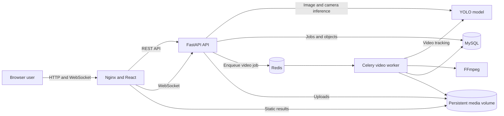

# Architecture

## System overview

## Processing modes

### Image

1. Validate upload.
2. Store source image.
3. Run YOLO detection.
4. Save annotated image.
5. Persist job and objects.
6. Return the completed response.

### Video

1. Validate and store video.
2. Create a pending job.
3. Enqueue a Celery task.
4. Track objects with YOLO.
5. Encode the result with FFmpeg.
6. Persist progress and unique tracks.

### Camera

1. Browser requests camera access.
2. Browser sends JPEG frames through WebSocket.
3. FastAPI performs persistent tracking.
4. Browser draws bounding boxes.
5. Only metrics and representative tracks are persisted.

## Storage policy

- MySQL stores job metadata and representative objects.
- Redis stores Celery queue data.
- Upload and result files use named Docker volumes.
- Model weights are supplied outside Git.
- Camera source frames are not persisted.